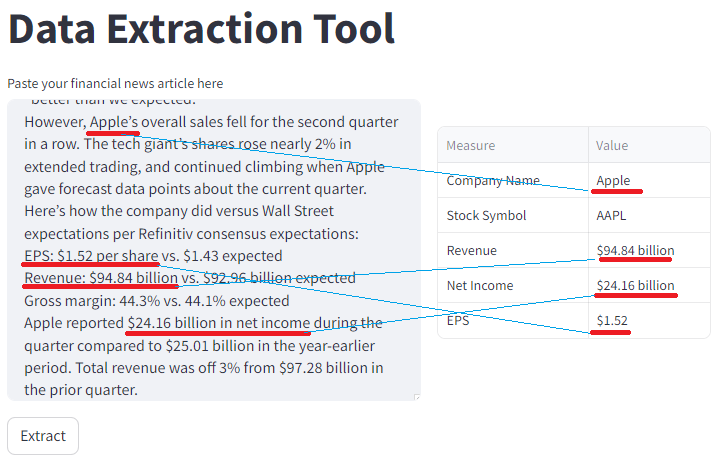
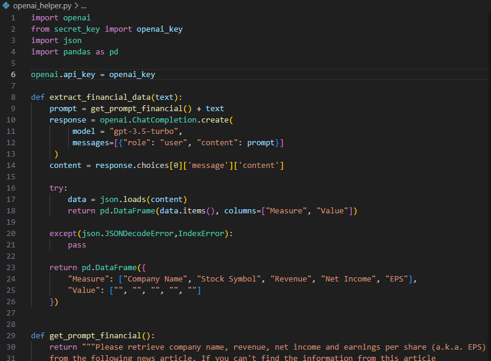
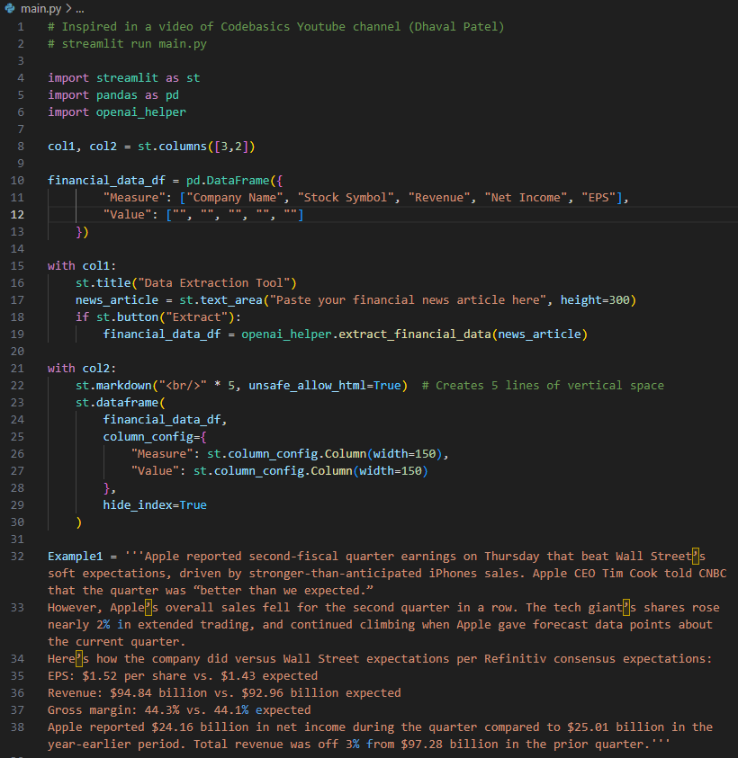

# Financial Data Extraction Tool (OpenAI API project)

Simple tool to extract financial data from a text given using the OpenAI API (OpenAI ChatCompletion). App written in Python (back-end) and Streamlit (front-end).<br>
All you must do is put a text or an article in the text area and the app will extract key financial measures such as company name, stock symbol, revenue, net income etc. The text or article is typically an article about company's finance reporting. 



## Articles examples for tests
Here are some sample texts you can ask in the app.

**Example 1**<br>
Apple reported second-fiscal quarter earnings on Thursday that beat Wall Street’s soft expectations, driven by stronger-than-anticipated iPhones sales. Apple CEO Tim Cook told CNBC that the quarter was “better than we expected.” 
However, Apple’s overall sales fell for the second quarter in a row. The tech giant’s shares rose nearly 2% in extended trading, and continued climbing when Apple gave forecast data points about the current quarter.
Here’s how the company did versus Wall Street expectations per Refinitiv consensus expectations: 
EPS: $1.52 per share vs. $1.43 expected 
Revenue: $94.84 billion vs. $92.96 billion expected 
Gross margin: 44.3% vs. 44.1% expected 
Apple reported $24.16 billion in net income during the quarter compared to $25.01 billion in the year-earlier period. Total revenue was off 3% from $97.28 billion in the prior quarter.

**Example 2**<br>
HDFC Bank on April 15 reported a 21 percent YoY rise in consolidated net profit to Rs 12,594.5 crore for the quarter ended March 31. The private lender posted a 20.3 percent YoY growth in consolidated net revenue to Rs 34,552.8 crore during the quarter, against Rs 28,733.9 crore recorded during the quarter ended March 31, 2022.
Profit before tax (PBT) for the quarter ended March 31, 2023 was at Rs 15,935.5 crore. After providing Rs 3,888.1 crore for taxation, the bank earned a net profit of Rs 12,047.5 crore, an increase of 19.8 percent over the quarter ended March 31, 2022.
Net interest income (NII), or the difference between interest earned and interest expended, grew by 23.7 percent to Rs 23,351 crore from Rs 18,872 crore for the quarter ended March 31, 2023, HDFC Bank said in an exchange filing.
The average of a poll of three brokerages estimated that the profits will rise to Rs 12,181 crore. Net interest income (NII) was expected to increase 30.5 percent on-year (up 8.8 percent QoQ) to Rs 24,601.9 crore, whereas the average poll of estimates saw HDFC Bank to report 21.9 percent YoY rise in March quarter profits.

**Example 3**<br>
Tesla's earning this quarter blew all the estimates. They reported 4.5 billion \$ profit against a revenue of 30 billion \$. Their earnings per share was 2.3 \$

## Tech Stack
```commandline
Backend: Python + OpenAI API ChatCompletion
Frontend: Streamlit
```

## Installation
You need to install the modules mentioned in the requirements.txt file
```doctest
pip install -r requirements.txt
```
To replicate the project, you need to create an account on the OpenAI's developer platform website and use the initial $ 5 free start credits, then you can buy mor credits.<br>
You will get an API key from your account, and you have to add it in the _secret_key.py_ file.

## Running streamlit app
Run this command in a terminal
```commandline
streamlit run main.py
```

## Files explanation
**openai_helper.py**<br>
Python code that send the text to the OpenAI server and return the result as a DataFrame.


**main.py**<br>
Python code that manage the Frontend with Streamlit.


