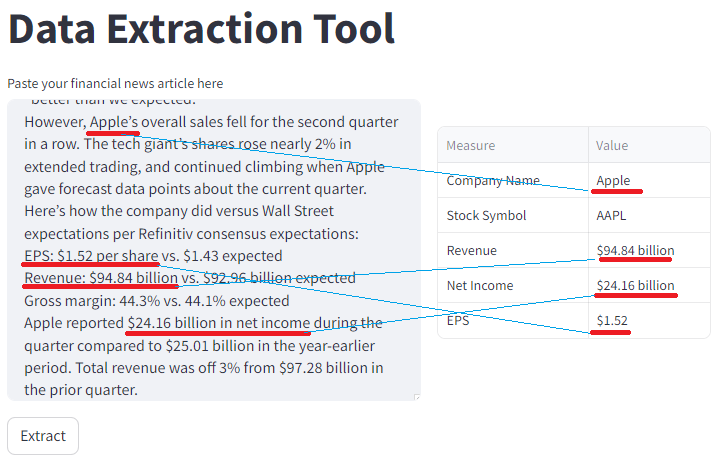
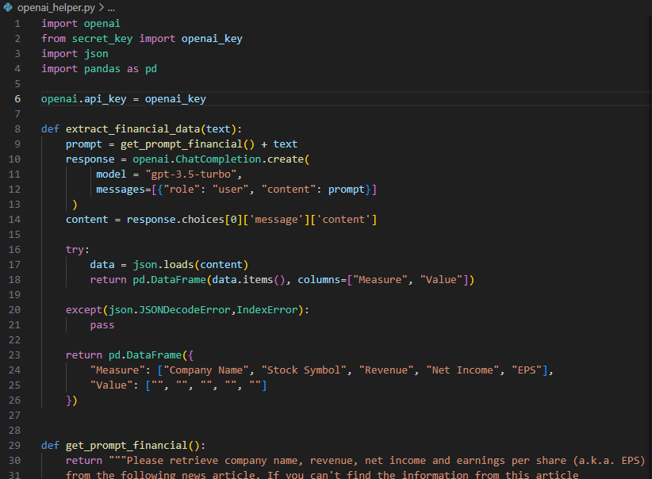
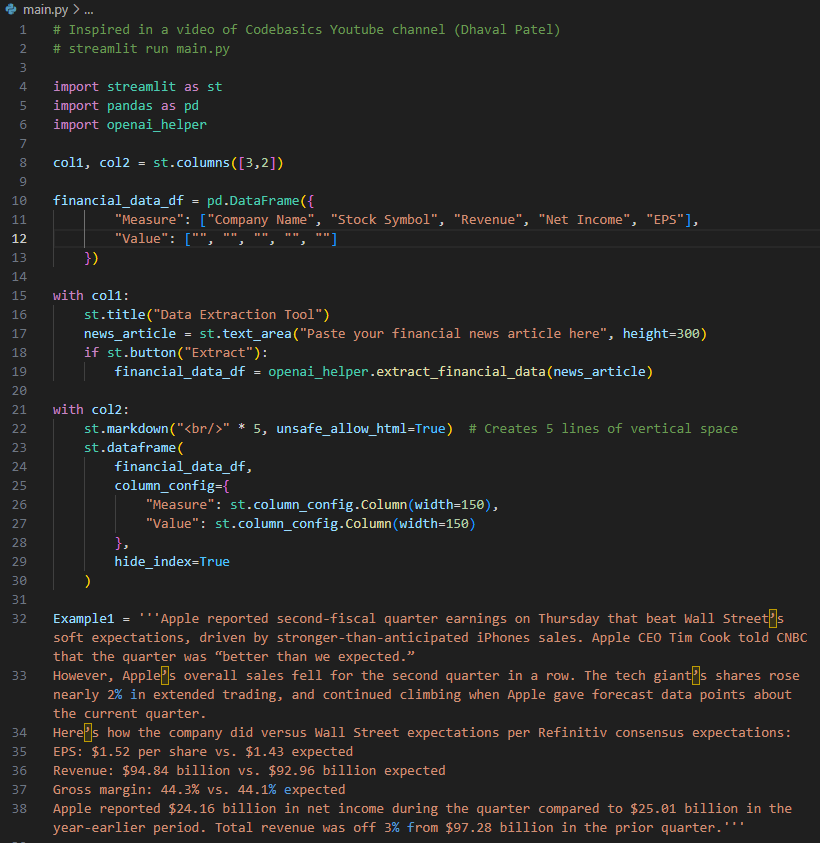

# Herramienta para la extracción de datos financieros (Proyecto OpenAI API)

Una versión en inglés y los archivos del proyecto se pueden encontrar [aquí](https://github.com/JorgeAlvarezOre/Data_projects/tree/main/OpenAI%20Financial%20Data%20Extraction).

Herramienta sencilla para extraer datos financieros de un texto dado mediante la API de OpenAI (OpenAI ChatCompletion). Aplicación escrita en Python (Backend) y Streamlit (Frontend).<br>
Todo lo que se debe hacer es colocar un texto o un artículo en el área de texto y la aplicación extraerá las medidas financieras clave, como el nombre de la empresa, el símbolo bursátil, los ingresos, los ingresos netos, etc. El texto o artículo suele ser un artículo sobre los informes financieros de la empresa.



## Artículos ejemplos para hacer pruebas (El texto o artículo tiene que estar en inglés)
Aquí hay algunos textos de muestra que puedes preguntar en la aplicación.

**Ejemplo 1**<br>
Apple reported second-fiscal quarter earnings on Thursday that beat Wall Street’s soft expectations, driven by stronger-than-anticipated iPhones sales. Apple CEO Tim Cook told CNBC that the quarter was “better than we expected.” 
However, Apple’s overall sales fell for the second quarter in a row. The tech giant’s shares rose nearly 2% in extended trading, and continued climbing when Apple gave forecast data points about the current quarter.
Here’s how the company did versus Wall Street expectations per Refinitiv consensus expectations: 
EPS: $1.52 per share vs. $1.43 expected 
Revenue: $94.84 billion vs. $92.96 billion expected 
Gross margin: 44.3% vs. 44.1% expected 
Apple reported $24.16 billion in net income during the quarter compared to $25.01 billion in the year-earlier period. Total revenue was off 3% from $97.28 billion in the prior quarter.

**Ejemplo 2**<br>
HDFC Bank on April 15 reported a 21 percent YoY rise in consolidated net profit to Rs 12,594.5 crore for the quarter ended March 31. The private lender posted a 20.3 percent YoY growth in consolidated net revenue to Rs 34,552.8 crore during the quarter, against Rs 28,733.9 crore recorded during the quarter ended March 31, 2022.
Profit before tax (PBT) for the quarter ended March 31, 2023 was at Rs 15,935.5 crore. After providing Rs 3,888.1 crore for taxation, the bank earned a net profit of Rs 12,047.5 crore, an increase of 19.8 percent over the quarter ended March 31, 2022.
Net interest income (NII), or the difference between interest earned and interest expended, grew by 23.7 percent to Rs 23,351 crore from Rs 18,872 crore for the quarter ended March 31, 2023, HDFC Bank said in an exchange filing.
The average of a poll of three brokerages estimated that the profits will rise to Rs 12,181 crore. Net interest income (NII) was expected to increase 30.5 percent on-year (up 8.8 percent QoQ) to Rs 24,601.9 crore, whereas the average poll of estimates saw HDFC Bank to report 21.9 percent YoY rise in March quarter profits.

**Ejemplo 3**<br>
Tesla's earning this quarter blew all the estimates. They reported 4.5 billion \$ profit against a revenue of 30 billion \$. Their earnings per share was 2.3 \$

## Tecnología usadas
```commandline
Backend: Python + OpenAI API ChatCompletion
Frontend: Streamlit
```

## Instalación
Debe instalar los módulos mencionados en el archivo requirements.txt
```doctest
pip install -r requirements.txt
```

Para replicar el proyecto necesita crear una cuenta en el sitio web de OpenAI para desarrolladores y podrá usar los créditos iniciales gratuitos de $ 5, luego podrá comprar más créditos.<br>
Obtendrá una clave API de su cuenta y deberá agregarla en el archivo _secret_key.py_ .

## Running streamlit app
Ejecute este comando en un terminal
```commandline
streamlit run main.py
```

## Explicación de los archivos
**openai_helper.py**<br>
Código Python que envía el texto al servidor OpenAI y devuelve el resultado como un DataFrame.


**main.py**<br>
Código Python que gestiona el Frontend con Streamlit.

