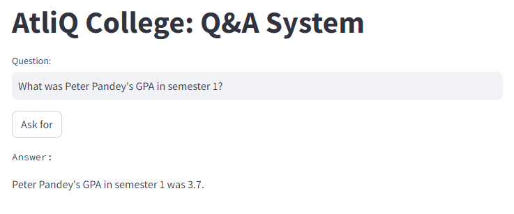
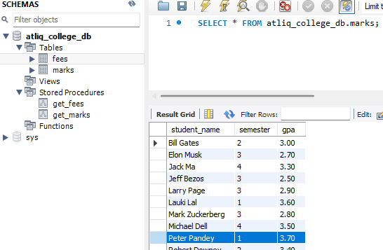
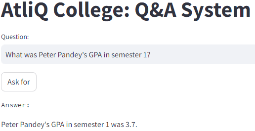
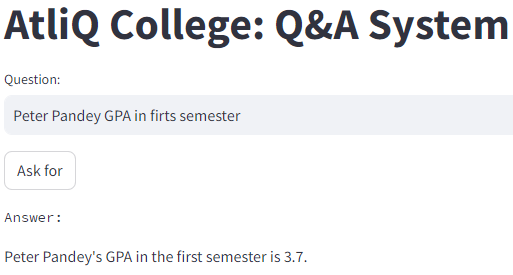
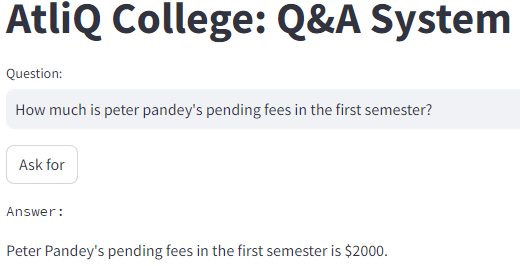
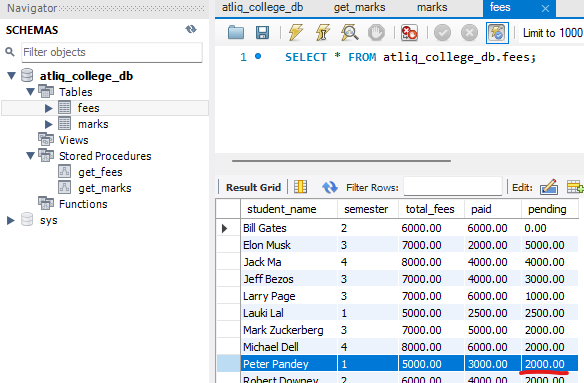
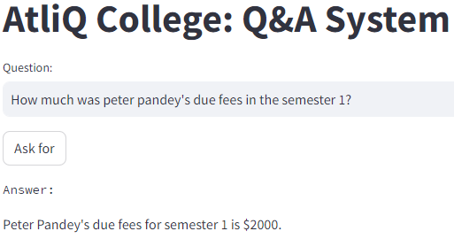
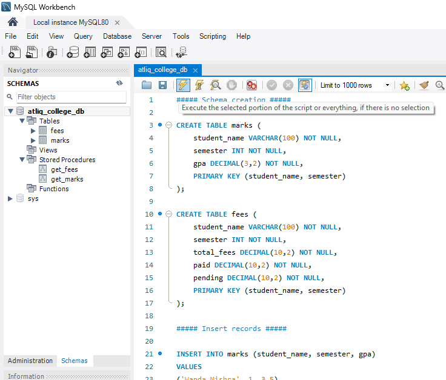
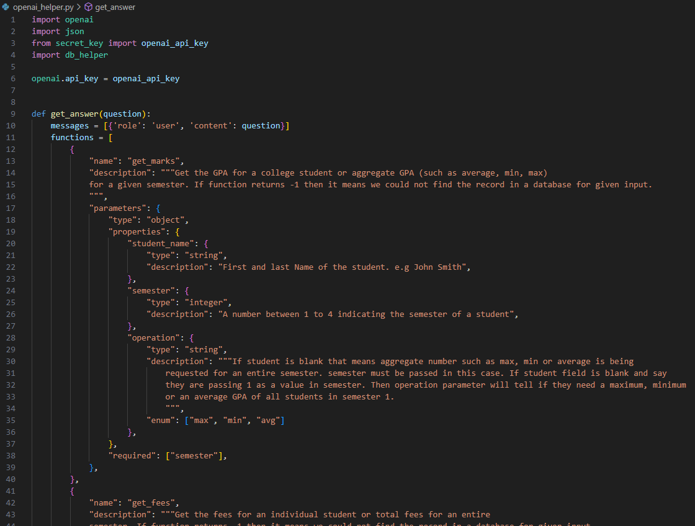
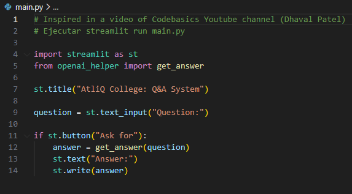

# Question and answer system in a custom database (OpenAI API + SQL project)

Building a question-and-answer system that respond as ChatGPT but fetch a reply from an internal organization database using the OpenAI API (OpenAI Function Calling). App written in Python (back-end) and Streamlit (front-end).<br>
Simple put a question in the input area and the system will fetch the answer from an internal imaginary database of a college.

**Example of asking the system**<br>


**Checking the question and answer in a classic database software (MySQL)**<br>



## Question examples for tests
Here are some sample questions you can ask to this Q&A system.

**Example 1**<br>
What was Peter Pandey's GPA in semester 1?<br>



**Example 2**<br>
Peter Pandey GPA in firts semester<br>



**Example 3**<br>
How much is peter pandey's pending fees in the first semester?<br>



**Example 4**<br>
How much was peter pandey's due fees in the semester 1?<br>



## Tech Stack

```commandline
Database: MySQL
Backend: Python + OpenAI API Function Calling
Frontend: Streamlit
```

## Set Up

1. Database: In _db_ directory you will see a SQL file. Just run that entire script in your MySQL workbench (atliq_college_db schema)<br>

2. Python code: You need to install following modules
   ```commandline
   pip install -r requirements.txt
   ```
3. OpenAI API setup: You need to obtain a secret key from  your openai account and put it in _secret_key.py_ file . You need to create an account on the OpenAI's developer platform website and you will be given an initial credit of $ 5 which should be enough for the project, then you can purchase more credits.

## Running streamlit app

From your command line run this command
```commandline
streamlit run main.py
```

## Files explanation
**db_helper.py**<br>
Python code that connects to MySQL Workbench.<br>


**openai_helper.py**<br>
Python code that sends the text to the OpenAI server and return the result as a string.<br>


**main.py**<br>
Python code that manage the Frontend with Streamlit.<br>

