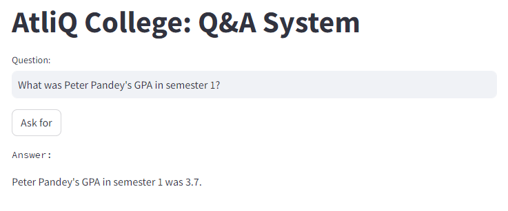
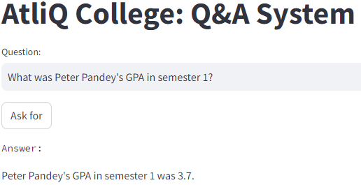
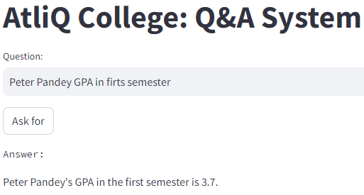
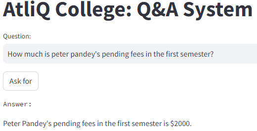
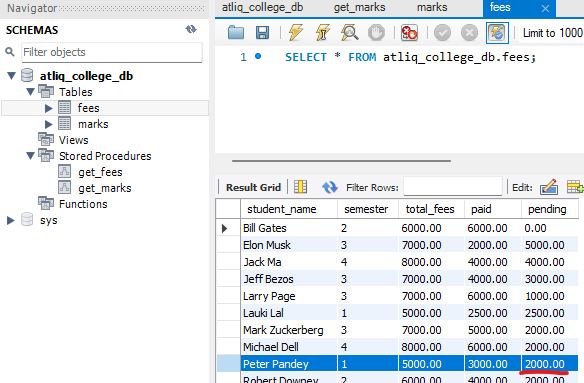
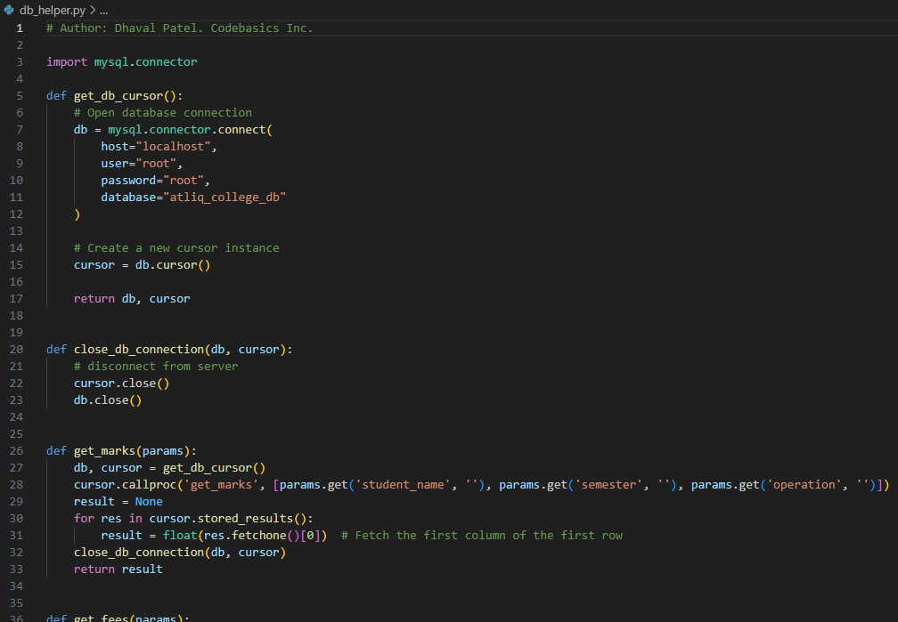

# Sistema de preguntas y respuestas en una base de datos personalizada (Proyecto OpenAI API + SQL)

Creación de un sistema de preguntas y respuestas que responde como ChatGPT pero obtiene las respuestas de una base de datos interna de una universidad ficticia utilizando la API de OpenAI (OpenAI Function Calling). Aplicación escrita en Python (Backend) y Streamlit (Frontend)<br>
Simplemente haga una pregunta en el área de entrada (Input) y el sistema obtendrá la respuesta de una base de datos interna imaginaria de una universidad ficticia.

**Ejemplo de pregunta al sistema**<br>


**Comprobación de preguntas y respuestas en un software de base de datos clásico (MySQL)**<br>


## Ejemplos de preguntas para hacer pruebas
Aquí hay algunos ejemplos de preguntas que se pueden hacer a este sistema de preguntas y respuestas (Se tiene que consultar en inglés).

**Ejemplo 1**<br>
What was Peter Pandey's GPA in semester 1?<br>



**Ejemplo 2**<br>
Peter Pandey GPA in firts semester<br>



**Ejemplo 3**<br>
How much is peter pandey's pending fees in the first semester?<br>



**Ejemplo 4**<br>
How much was peter pandey's due fees in the semester 1?<br>


## Tecnología usadas

```commandline
Base de datos: MySQL
Backend: Python + OpenAI API Function Calling
Frontend: Streamlit
```

## Configuración

1. Base de datos: En la carpeta _db_ verá un archivo script SQL que simplemente tendrá que ejecutar por completo en MySQL Workbench (schema atliq_college_db)<br>

2. Código Python: Necesitas instalar los siguientes módulos
   ```commandline
   pip install -r requirements.txt
   ```
3. Configuración de la API de OpenAI: Debe obtener una clave secreta de su cuenta de OpenAI y colocarla en el archivo _secret_key.py_ . Debe crear una cuenta en la web de desarrolladores de OpenAI y se le dará un crédito inicial de $ 5 que debería ser suficiente para el proyecto, luego puede comprar más créditos.

## Ejecutando streamlit app

Desde una terminal ejecute este comando
```commandline
streamlit run main.py
```

## Explicación de los archivos
**db_helper.py**<br>
Código Python que se conecta a MySQL Workbench.<br>


**openai_helper.py**<br>
Código Python que envía el texto al servidor OpenAI y devuelve el resultado como un string.<br>


**main.py**<br>
Código Python que gestiona el Frontend con Streamlit.<br>

