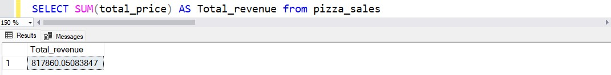
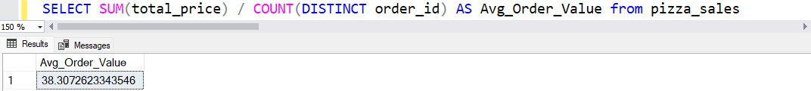
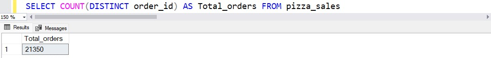
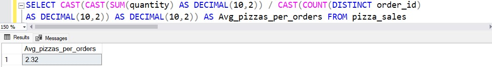
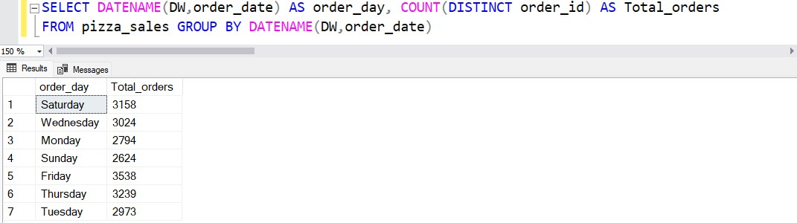
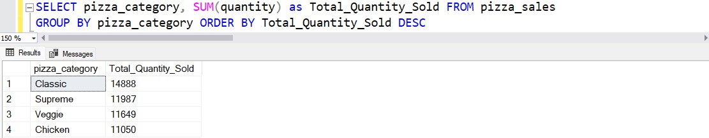
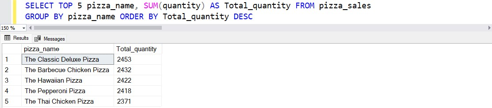
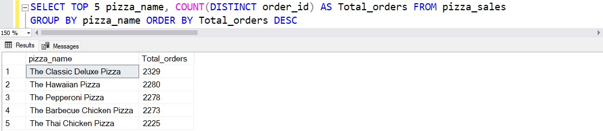
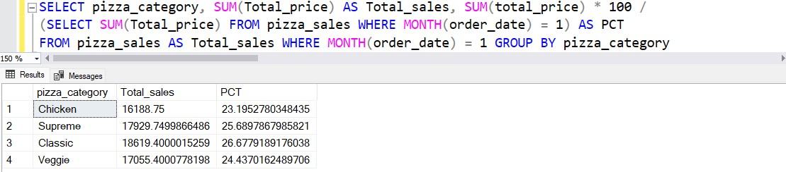

# PIZZA SALES REPORT (SQL + Power BI project)

## Intro
We have a year of sales data of a Pizza Store with fields like 'pizza name', 'quantity', 'order price', 'order date and time', etc.
We need to analyze the Key Performance Indicators (KPI) and some charts of the store to gain insights of our business Performance and understand key trends.

## Data
We have a \*.CSV file with every sale of the year divided as follows.

## KPIs
1. **Total revenue:** The sum of total price of all pizza
2. **Average order value:** The average amount spent per order calculated by dividing the total revenue by the total number of orders.
3. **Total pizzas sold:** The sum of the quantities of all pizzas sold.
4. **Total orders:** The total number of orders placed.
5. **Average pizzas per orders:** The average number of pizzas sold per order, calculated by dividing the total number of pizzas sold by the total number of orders.

## Charts requirement
6. **Daily trend for total orders:** Bar chart that will help us identify any patterns or fluctuations in order volumes on a daily basis.
7. **Monthy trend for total orders:** Line chart that will allow us to identify peak hours or periods of high order activity.
8. **Percentage of sales by pizza category:** Pie chart will provide insights into the popularity of various pizza categories and the contribution to overall sales.
9. **Percentage of sales by pizza size:** Pie chart that will help us understand customer preferences for pizza sizes and their impact on sales.
10. **Total pizzas sold by pizza category:** Funnel chart that will allow us to compare the sales performance of different pizza categories.
11. **Top 5 best sellers by revenue, total quantity and total orders:** Bar chart that will help us identify the most popular pizza options.
12. **Bottom 5 best sellers by revenue, total quantity and total orders:** Bar chart that will help us identify the less popular pizza options.

## SQL Queries
1. **Total revenue:** 

2. **Average order value:** 

3. **Total pizzas sold:** 

4. **Total orders:** 

5. **Average pizzas per orders:** 

6. **Daily trend for total orders:** 

7. **Monthy trend for total orders:** 

8. **Percentage of sales by pizza category:** 

9. **Percentage of sales by pizza size:** 

10. **Total pizzas sold by pizza category:** 

11. **Top 5 best sellers by revenue, total quantity and total orders:** 
Top 5 Pizzas by Revenue 
  
Top 5 Pizzas by Quantity 
  
Top 5 Pizzas by Total Orders 
  

12. **Bottom 5 best sellers by revenue, total quantity and total orders:** 
Bottom 5 Pizzas by Revenue 
  
Bottom 5 Pizzas by Quantity 
  
Bottom 5 Pizzas by Total Orders 
  

13. **Bonus:** 
If you want to apply the pizza_category or pizza_size filters to the above queries you can use WHERE clause. Example: 
  

## Power BI dashboard

