# PIZZA REPORTE DE VENTAS (Proyecto SQL + Power BI)

A English version and the files used in this projet is available [here](https://github.com/JorgeAlvarezOre/Data_projects/tree/main/SQL__Power_BI).

## Introducción
Tenemos un año de datos de ventas de una pizzería con columnas como 'nombre de la pizza', 'cantidad', 'precio del pedido', 'fecha y hora del pedido', etc. (nombres de las columnas en inglés).
Necesitamos analizar los Key Performance Indicators (KPI o Indicadores de Rendimiento en español) y algunos gráficos para obtener información sobre el rendimiento del negocio y comprender las tendencias.

## Datos
Tenemos un archivo \*.CSV con información de cada venta del año.
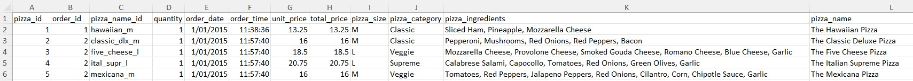

## KPIs
1. **Total de ingresos:** La suma del precio (price) de todas las pizzas.
2. **Valor medio del pedido:** El promedio gastado por pedido que se calcula dividiendo los ingresos totales por el número total de pedidos.
3. **Total de pizzas vendidas:** La suma de las cantidades (quantity) de todas las pizzas vendidas.
4. **Total de ordenes:** El número total de pedidos realizados.
5. **Promedio de pizzas por pedido:** El número promedio de pizzas vendidas por pedido, calculado dividiendo el número total de pizzas vendidas por el número total de pedidos.

## Gráficos
6. **Tendencia diaria de pedidos totales:** Gráfico de barras que nos ayudará a identificar patrones o fluctuaciones en los volúmenes de pedidos diarios.
7. **Tendencia mensual de pedidos totales:** Gráfico de líneas que nos permitirá identificar periodos mensuales de actividad de altas ordenes.
8. **Porcentaje de ventas por categoría de pizza:** Gráfico circular que proporcionará información sobre la popularidad de varias categorías de pizza y su contribución a las ventas generales.
9. **Porcentaje de ventas por tamaño de pizza:** Gráfico circular que nos ayudará a comprender las preferencias de los clientes en cuanto a los tamaños de pizza y su impacto en las ventas.
10. **Total de pizzas vendidas por categoría:** Gráfico de embudo que nos permitirá comparar el desempeño de ventas de diferentes categorías de pizzas.
11. **Los 5 más vendidos por ingresos, cantidad total y pedidos totales:** Gráfico de barras que nos ayudará a identificar las opciones de pizza más populares.
12. **Los 5 últimos más vendidos por ingresos, cantidad total y pedidos totales:** Gráfico de barras que nos ayudará a identificar las opciones de pizza menos populares.

## SQL Queries
1. **Total de ingresos:** 
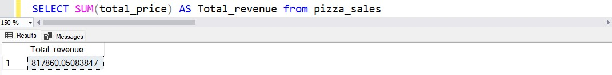

2. **Valor medio del pedido:** 
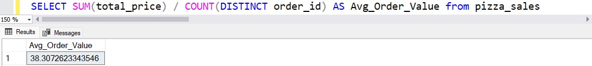

3. **Total de pizzas vendidas:** 
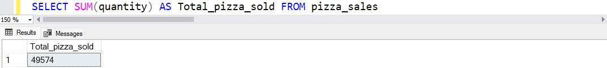

4. **Total de ordenes:** 
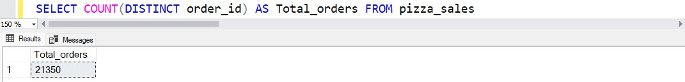

5. **Promedio de pizzas por pedido:** 
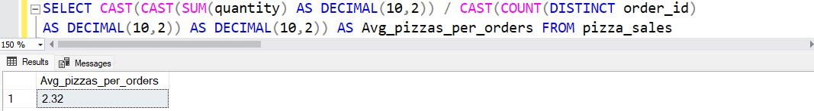

6. **Tendencia diaria de pedidos totales:** 
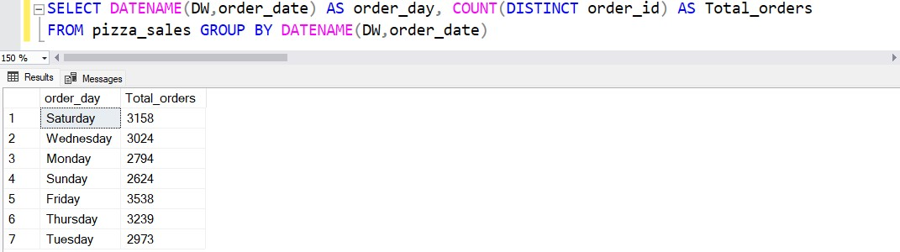

7. **Tendencia mensual de pedidos totales:** 
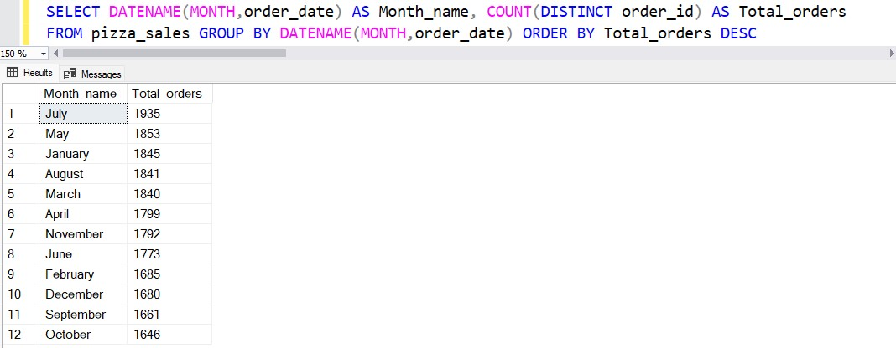

8. **Porcentaje de ventas por categoría de pizza:** 
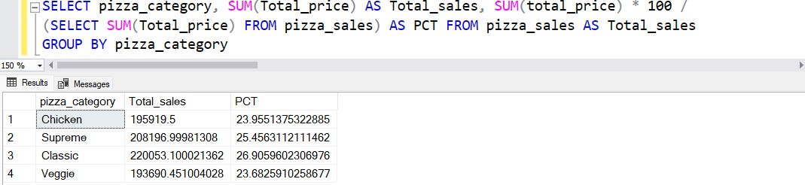

9. **Porcentaje de ventas por tamaño de pizza:** 
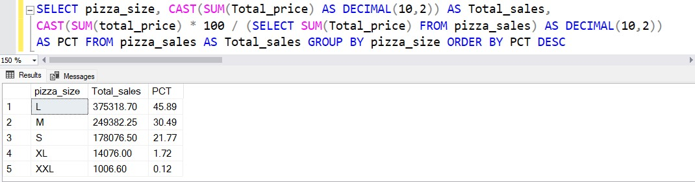

10. **Total de pizzas vendidas por categoría:** 
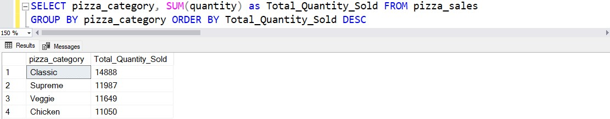

11. **Los 5 más vendidos por ingresos, cantidad total y pedidos totales:** 
Las 5 mejores pizzas por ingresos 
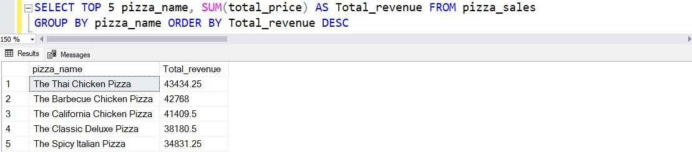  
Las 5 mejores pizzas por cantidad 
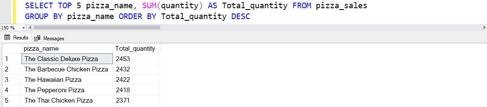  
Las 5 mejores pizzas por pedidos totales 
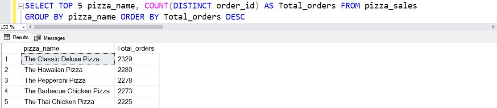  

12. **Los 5 últimos más vendidos por ingresos, cantidad total y pedidos totales:** 
Las 5 últimas pizzas por ingresos 
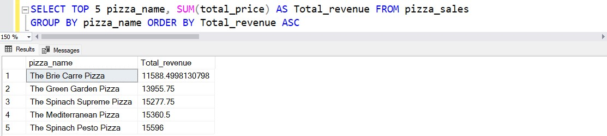  
Las 5 últimas pizzas por cantidad 
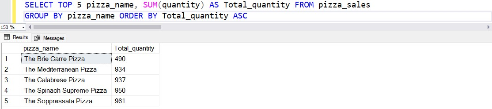  
Las 5 últimas pizzas por pedidos totales 
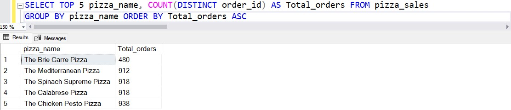  

13. **Bonus:** 
Si se desea aplicar los filtros pizza_category o pizza_size a las consultas anteriores, puede utilizar la cláusula WHERE. Ejemplo: 
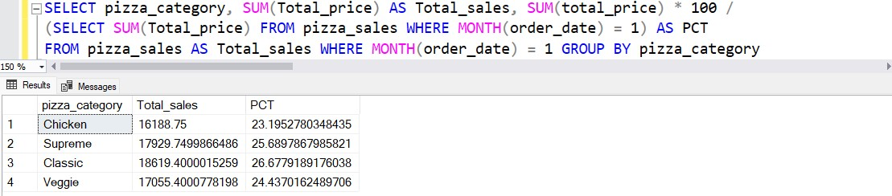  

## Power BI dashboard
Dashboard Power Bi interactivo en línea que muestra en dos páginas los KPI y los gráficos  anteriormente mencionados. La página "Inicio" ilustra los días y horas de mayor actividad y algunos otros KPIs, mientras los "Mejores/peores vendidas", las pizzas más y menos vendidas respectivamente.

<https://app.powerbi.com/view?r=eyJrIjoiNTNhNWUwZWItOGEyMi00YjhjLWJhZDAtNzNiMzBhZDg4OGIyIiwidCI6IjgzZGMwYzk0LWRkNTgtNDlmNC05YmI0LTU4NDhjMWM3NmYzYyJ9>

[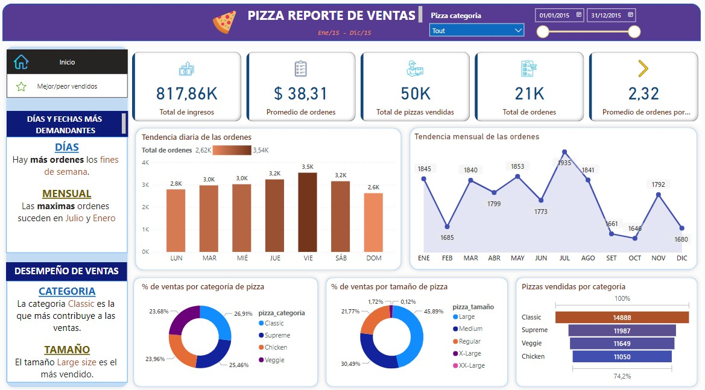](https://app.powerbi.com/view?r=eyJrIjoiNTNhNWUwZWItOGEyMi00YjhjLWJhZDAtNzNiMzBhZDg4OGIyIiwidCI6IjgzZGMwYzk0LWRkNTgtNDlmNC05YmI0LTU4NDhjMWM3NmYzYyJ9)
