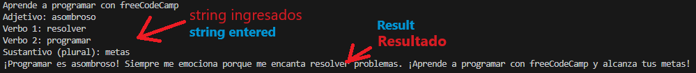
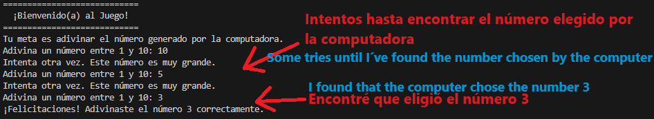
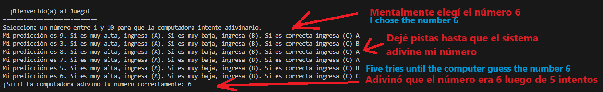
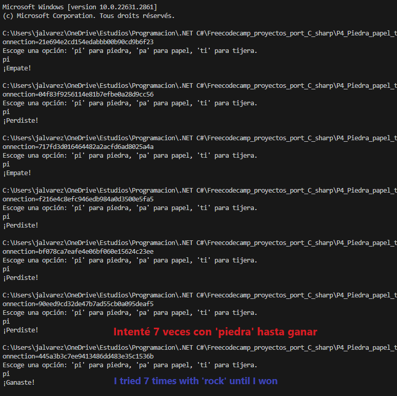
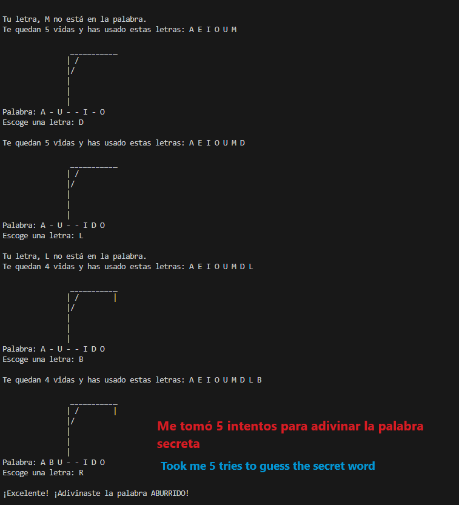
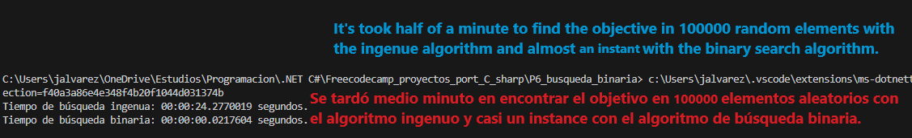

# Seis miniaplicaciones en C# (Proyecto de porteo desde Python a C#)
Practicando mis estudios autodidactas de C# porteando los 6 proyectos básicos de Python presentados en el canal de Youtube 'freeCodeCamp Español' desde Python a .NET C#.

El código para cada una de las 6 mini aplicaciones se mostrará y explicará a continuación.

## Tecnologías usadas
```
Backend: .NET C#
IDE: Visual Studio Code
```

## 1 Historias locas
El sistema pedirá algunas palabras y luego concatenará las palabras ingresadas por el usuario en oraciones divertidas.

Código:
```
string organización = "freeCodeCamp"; // Cadena de caracteres asignada a una variable string

Console.WriteLine("Aprende a programar con " + organización); // Concatenar
Console.WriteLine($"Aprende a programar con {organización}");

// Mad Libs (Historias Locas)

Console.Write("Adjetivo: ");
string adj = Console.ReadLine(); // asombroso
Console.Write("Verbo 1: ");
string verbo1 = Console.ReadLine(); // resolver
Console.Write("Verbo 2: ");
string verbo2 = Console.ReadLine(); // programar
Console.Write("Sustantivo (plural): ");
string sustantivo_plural = Console.ReadLine(); // metas, objetivos

string madlib = $"¡Programar es {adj}! Siempre me emociona porque me encanta {verbo1} problemas. ¡Aprende a {verbo2} con freeCodeCamp y alcanza tus {sustantivo_plural}!";

Console.WriteLine(madlib);
Console.ReadLine();
```



## 2 Adivina el número
El usuario adivina el número aleatorio generado por la computadora.

Código:
```
void Adivina_el_número(int x)
{
    Console.WriteLine("============================");
    Console.WriteLine("  ¡Bienvenido(a) al Juego!  ");
    Console.WriteLine("============================");
    Console.WriteLine("Tu meta es adivinar el número generado por la computadora.");

    Random rnd = new Random();
    int número_aleatorio = rnd.Next(1, x+1); // número aleatorio entre 1 y x.

    // La predicción es 0 inicialmente para que no coincida con el número aleatorio. 
    int prediccion = 0;
    
    // Continuar prediciendo el número hasta que la predicción sea correcta.
    while(prediccion != número_aleatorio)
    {
        // El usuario ingresa un número.
        Console.Write($"Adivina un número entre 1 y {x}: ");
        prediccion = Convert.ToInt32(Console.ReadLine());
        // Si el número es menor que el número aleatorio, se muestra un mensaje.
        if(prediccion < número_aleatorio)
        {
            Console.WriteLine("Intenta otra vez. Este número es muy pequeño.");
        }
        // Si el número es mayor que el número aleatorio, se
        // muestra un mensaje.
        else if(prediccion > número_aleatorio)
        {
            Console.WriteLine("Intenta otra vez. Este número es muy grande.");
        }
    }
    // El ciclo o bucle se detiene cuando el usuario adivina el número
    // correctamente y se muestra un mensaje final.
    Console.WriteLine($"¡Felicitaciones! Adivinaste el número {número_aleatorio} correctamente.");
}

Adivina_el_número(10);
```



## 3 La computadora adivina el número
La computadora debe adivinar el número seleccionado por el usuario.

Código:
```
void adivina_el_numero_computadora(int x)
{
    Console.WriteLine("============================");
    Console.WriteLine("  ¡Bienvenido(a) al Juego!  ");
    Console.WriteLine("============================");
    Console.WriteLine($"Selecciona un número entre 1 y {x} para que la computadora intente adivinarlo.");

    // Intervalo de valores válidos
    int límite_inferior = 1;
    int límite_superior = x;
    string respuesta = "";
    int prediccion = 0;

    // Miestras el usuario no indique que la respuesta es correcta, continuar el proceso.
    while(respuesta != "c")
    {
        // Generar predicción
        if(límite_inferior != límite_superior)
        {
            Random rnd = new Random();
            prediccion = rnd.Next(límite_inferior, límite_superior+1);
        }
        else
        {
            prediccion = límite_inferior;  // también podría ser límite_superior porque los límites son iguales.
        }
        // Obtener respuesta del usuario
        Console.Write($"Mi predicción es {prediccion}. Si es muy alta, ingresa (A). Si es muy baja, ingresa (B). Si es correcta ingresa (C) ");
        respuesta = Console.ReadLine().ToLower();
        
        if(respuesta == "a")
        {
            límite_superior = prediccion - 1;
        }
        else if(respuesta == "b")
        {
            límite_inferior = prediccion + 1;
        }
    }
    Console.WriteLine($"¡Siii! La computadora adivinó tu número correctamente: {prediccion}");
}

adivina_el_numero_computadora(10);
```



## 4 Juego Piedra-Papel-tijera
Jugando al clásico juego Piedra-Papel-Tijera con la computadora

Código:
```
string jugar()
{
    Console.WriteLine("Escoge una opción: 'pi' para piedra, 'pa' para papel, 'ti' para tijera.");
    string usuario = Console.ReadLine().ToLower();

    Random rnd = new Random();
    var list = new List<string> {"pi", "pa", "ti"};
    int index = rnd.Next(list.Count);
    string computadora = list[index];

    if(usuario == computadora)
        return "¡Empate!";

    if(ganó_el_jugador(usuario, computadora))
        return "¡Ganaste!";
    
    return "¡Perdiste!";
}


bool ganó_el_jugador(string jugador, string oponente)
{
    // Retornar true (verdadero) si gana el jugador.
    // Piedra gana a Tijera (pi > ti).
    // Tijera gana a Papel (ti > pa).
    // Papel gana a Piedra (pa > pi).
    if((jugador == "pi" && oponente == "ti") || (jugador == "ti" && oponente == "pa") || (jugador == "pa" && oponente == "pi"))
        return true;
    else
        return false;
}

Console.WriteLine(jugar());
```



## 5 Juego del ahorcado
El clásico juego del ahorcado en el que tienes que adivinar una palabra con intentos limitados. Tienes que descargar los archivos Palabras.cs y Ahorcado_diagramas.cs en la misma carpeta para poder ejecutar el siguiente código.

Código:
```
using P5_Ahorcado.Palabras;
using P5_Ahorcado.Ahorcado_diagramas;

Dictionary<int,string> vidas_diccionario_visual = Ahorcado_diagramas.vidas_diccionario_visual;
// Console.WriteLine(vidas_diccionario_visual[0]);

string obtener_palabra_válida(List<string> palabras)
{
    Random rnd = new Random();
    int index = rnd.Next(palabras.Count);
    string palabra = palabras[index];  // seleccionar una palabra al azar de la lista

    // Si la palabra contiene un guión o un espacio,
    // seguir seleccionando una palabra al azar.
    while(palabra.Contains("-") || palabra.Contains(" "))
    {
        index = rnd.Next(palabras.Count);
        palabra = palabras[index];
    }
    return palabra.ToUpper();
}

void ahorcado()
{
    Console.WriteLine("=======================================");
    Console.WriteLine(" ¡Bienvenido(a) al juego del Ahorcado! ");
    Console.WriteLine("=======================================");

    List<string> palabras = Palabras.palabras;
    string palabra = obtener_palabra_válida(palabras);
    HashSet<char> letras_por_adivinar = new HashSet<char>(palabra); // conjunto de letras de la palabra que deben ser adivinadas.
    HashSet<char> abecedario = new HashSet<char>("ABCDEFGHIJKLMNOPQRSTUVWXYZ"); // conjunto de letras en el abecedario.
    HashSet<char> letras_adivinadas = new HashSet<char>();  // letras que el usuario ha advinado durante el juego.

    int vidas = 7;

    // Obtener respuesta del usuario mientras existan 
    // letras pendientes y al jugador le queden vidas.
    while(letras_por_adivinar.Count > 0 && vidas > 0)
    {
        // Letras adivinadas:
        // String.Join(" ", letras_adivinadas) ['a', 'b', 'c'] --> 'a b c'
        string letras_adivinadas_temp = String.Join(" ", letras_adivinadas);
        Console.WriteLine($"Te quedan {vidas} vidas y has usado estas letras: {letras_adivinadas_temp}");

        // Estado actual de la palabra que el jugador debe adivinar (por ejemplo:  H - L A)
        List<char> palabra_lista = new List<char>();
        foreach (char letra in palabra) // Recorrer cada letra de la palabra
        {
            if (letras_adivinadas.Contains(letra)) // Si la letra está en el conjunto de letras adivinadas
                palabra_lista.Add(letra); // Agregar la letra a la lista
            else // Si la letra no está en el conjunto
                palabra_lista.Add('-'); // Agregar un guión a la lista
        }

        Console.WriteLine(vidas_diccionario_visual[vidas]); // mostrar estado del ahorcado.
        string palabra_lista_temp = String.Join(" ", palabra_lista);
        Console.WriteLine($"Palabra: {palabra_lista_temp}"); // mostrar las letras separadas por un espacio.

        // El usuario escoge una letra nueva
        Console.Write("Escoge una letra: ");
        String letra_usuario = Console.ReadLine().ToUpper();

        // Si la letra escogida por el usuario está en el abecedario
        // y no está en el conjunto de letras que ya se han ingresado,
        // se añade la letra al conjunto de letras ingresadas.
        if(abecedario.Contains(letra_usuario[0]) && !letras_adivinadas.Contains(letra_usuario[0]))
        {
            letras_adivinadas.Add(letra_usuario[0]);
            // Si la letra está en la palabra, quitar la letra 
            // del conjunto de letras pendientes por adivinar. 
            if(letras_por_adivinar.Contains(letra_usuario[0]))
            {
                letras_por_adivinar.Remove(letra_usuario[0]);
                Console.WriteLine("");
            }
            // Si la letra no está en la palabra, quitar una vida.
            else
            {
                vidas = vidas - 1;
                Console.WriteLine($"\nTu letra, {letra_usuario} no está en la palabra.");
            }
        }
        // Si la letra escogida por el usuario ya fue ingresada.
        else if(letras_adivinadas.Contains(letra_usuario[0]))
            Console.WriteLine("\nYa escogiste esa letra. Por favor escoge una letra nueva.");
        else
            Console.WriteLine("\nEsta letra no es válida.");
    }

    // El juego llega a esta línea cuando se agotan las vidas del jugador 
    // o cuando se adivinan todas las letras de la palabra.
    if(vidas == 0)
    {
        Console.WriteLine(vidas_diccionario_visual[vidas]);
        Console.WriteLine($"¡Ahorcado! Perdiste. Lo lamento mucho. La palabra era: {palabra}");
    }
    else
        Console.WriteLine($"¡Excelente! ¡Adivinaste la palabra {palabra}!");
}

ahorcado();
```



## 6 Búsqueda binaria
Algoritmo de búsqueda para encontrar la posición de un valor objetivo dentro de una lista ordenada. Este algoritmo es más rápido que la forma tradicional de comparar los elementos de la lista uno a uno. Mencionar que la implementación de este código en Python es mucho más lenta (esperable ya que Python es un lenguaje de programación interpretado).

Código:
```
int búsqueda_ingenua(List<int> lista, int objetivo)
{
    // for i in range(len(lista)):
    //     if lista[i] == objetivo:
    //         return i
    
    for (int i = 0; i < lista.Count; i++)
    {
        if(lista[i] == objetivo)
            return i;
    }
    return -1;
}

int búsqueda_binaria(List<int> lista, int objetivo, int límite_inferior = -2, int límite_superior = -2)
{
    if(límite_inferior is -2)
        límite_inferior = 0; // Inicio de la lista
    if(límite_superior is -2)
        límite_superior = lista.Count - 1; // Final de la lista

    if(límite_superior < límite_inferior)
        return -1;

    int punto_medio = (límite_inferior + límite_superior)/2;

    if(lista[punto_medio] == objetivo)
        return punto_medio;
    else if(objetivo < lista[punto_medio])
        return búsqueda_binaria(lista, objetivo, límite_inferior, punto_medio-1);
    else
        return búsqueda_binaria(lista, objetivo, punto_medio+1, límite_superior);
}

int tamaño = 100000;
HashSet<int> conjunto_inicial = new HashSet<int>();
Random rnd = new Random();

while(conjunto_inicial.Count < tamaño)
    conjunto_inicial.Add(rnd.Next(-3*tamaño, 3*tamaño+1));

SortedList<int,int> lista_ordenada = new SortedList<int,int>();
foreach(int elemento in conjunto_inicial)
{
    lista_ordenada.Add(elemento,elemento);
}
List<int> lista_ordenada_list = lista_ordenada.Values.ToList();

// Medir el tiempo de búsqueda ingenua.
var inicio = DateTime.Now;
foreach(int objetivo in lista_ordenada_list)
    búsqueda_ingenua(lista_ordenada_list, objetivo);
var fin = DateTime.Now;
Console.WriteLine($"Tiempo de búsqueda ingenua: {fin - inicio} segundos.");

// Medir el tiempo de búsqueda binaria.
inicio = DateTime.Now;
foreach(int objetivo in lista_ordenada_list)
    búsqueda_binaria(lista_ordenada_list, objetivo);
fin = DateTime.Now;
Console.WriteLine($"Tiempo de búsqueda binaria: {fin - inicio} segundos.");
```


